# Hướng dẫn cách cài đặt Git và sử dụng dịch vụ Github

### ✍️: [toantc1024](https://github.com/toantc1024/)

# Git là gì vậy? Có ăn được hơm?? 🤔

Git là một hệ thống kiểm soát phiên bản theo dõi các phiên bản của tệp. Chúng ta thường sử dụng nó để có thể phát triển dự án chung với nhau dễ dàng và thuận tiện hơn. Mỗi một dự án được chia làm nhiều nhánh (tương ứng với các phiên bản khác nhau của dự án).

Github là một dịch vụ cung cấp kho lữu trữ mã nguồn Git trên đám mây.

Tuy nhiên, có các lệnh cơ bản mà các bạn phải nắm theo thứ tự đó là

`git init` - Khởi tạo hệ thống kiểm soát Git trên thư mục hiện tại

`git status` - Quản lý trạng thái của các file

`git add *`- Giúp bạn thêm các file để có thể kiểm soát. Dấu \* có thể là . (toàn bộ file trong thư mục hiện tại) hoặc là một file cụ thể nào đó.

`git commit -m "..."` - Giúp bạn ghi chú và chuyển trạng thái của các file đang kiểm soát (committed)

`git push -u origin <ten_nhanh>` là lệnh push code lần đầu lên một nhánh

`git push` là lệnh push code lần thứ 2 trở đi lên một nhánh

Ngoài ra còn rất nhiều lệnh để bạn có thể bỏ túi. Bạn có thể đọc thêm [tại đây](https://fullstack.edu.vn/blog/bo-tui-21-lenh-git-co-ban-cach-nho-giup-newdev-lam-chu-git-quan-ly-tot-ma-ngu.html)

`Ghi chú`: `Git != Github`

## Chuẩn bị trước khi tiến hành

- Tạo tài khoản Github và đăng nhập thành công
- Tải Git về máy của bạn [tại đây](https://git-scm.com/download/), nếu bạn chưa hiểu cách cài đặt có thể xem tại link sau nhe: [Windows](https://funix.edu.vn/chia-se-kien-thuc/cai-dat-git-va-git-bash-windows/) [Mac OS](https://www.codehub.com.vn/Huong-dan-cai-dat-Git-tren-macOS)

## Cấu hình Git

Giống như một cái máy Laptop mới mua bạn phải cấu hình tên của bạn, giống như vậy Git sau khi cài đặt chúng ta cần cấu hình tên và email của chúng ta.

Đầu tiên, bạn mở Git Bash

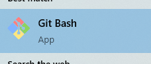

Để xem các cấu hình hiện tại bạn dùng lệnh

Bây giờ chúng ta sẽ tiến hành cấu hình tên và email của chúng ta bằng 2 lệnh sau

```sh
git config --global user.name 'ten_cua_ban'
# Ví dụ: git config --global user.name 'Newbie Coder'
git config --global user.email 'email_cua_ban'
# Ví dụ: git config --global user.email 'thanhnoobs@gmail.com'
```

Ghi chú: email và name có thể đặt tùy ý!

```sh
git config --list
```

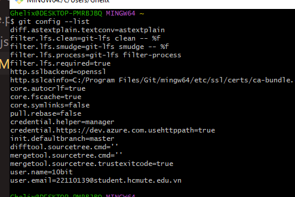

# Tạo một repo trên Github

Repo hay repository là một thư mục lưu trữ code của bạn trên Github. Chúng ta sẽ tiến hành tạo một repo trên Github như sau


Ấn vào dấu + trên thanh điều hướng của bạn chọn `New repository`

Bạn có thể đặt tên, mô tả tùy ý. Khi đặt ở chế độ Public code của bạn sẽ có thể được xem bởi mọi người và ngược lại với Private.
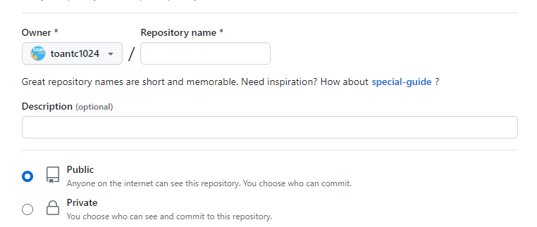

File README.md là bạn có thể viết ghi chú bằng ngôn ngữ Markdown, chính là cái mà bạn đang đọc. Tuy nhiên, trong hướng dẫn này mình sẽ hướng dẫn các bạn up code lên cho nên các bạn không cần phải tích README.md nhé!.

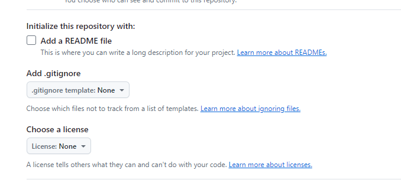

Tada, mình tạo được một repo rồi nè!

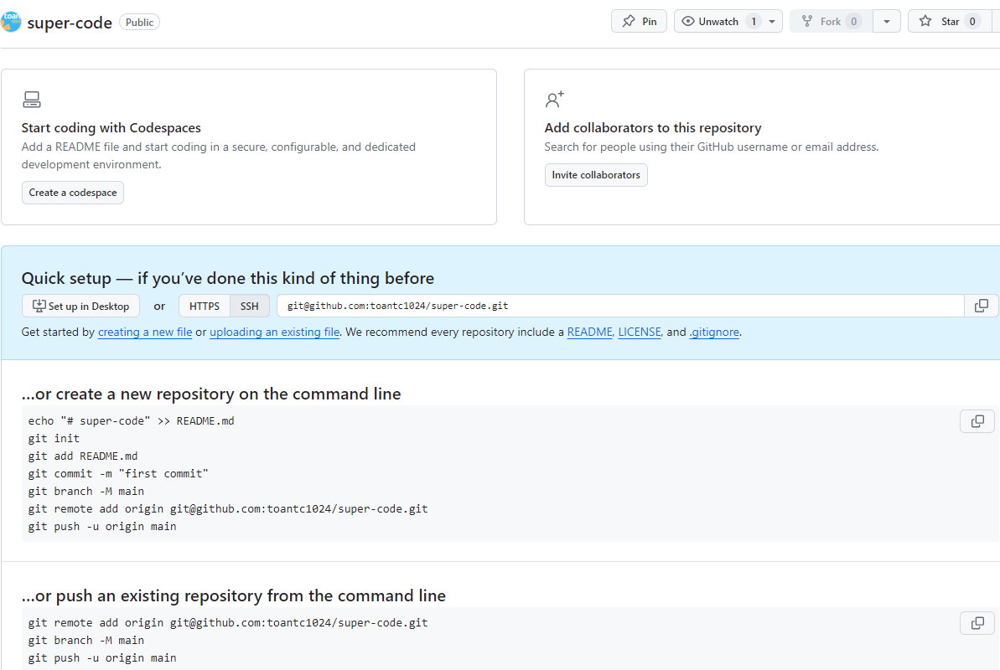

Để sử dụng lệnh Git trong VS Code bạn có thể sử dụng Terminal bằng cách

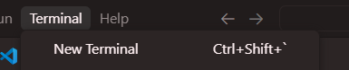

Hoặc dùng cmd và lệnh cd đến đường dẫn chứa code của bạn.

## Đăng tải code hiện tại trên máy lên Github lần đầu

Hiện tại bây giờ trên máy mình có một thư mục như sau:

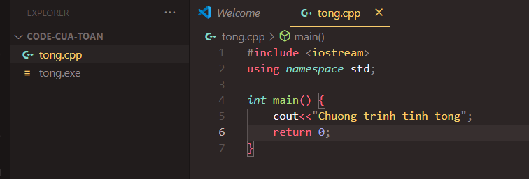

`Bước 1`: Do đây là thư mục chưa được cấu hình git nên mình sẽ dùng lệnh

```sh
git init
```

`Bước 2`: Mình sử dụng lệnh

```sh
git add .
```

Để thêm toàn bộ file. (Các khác là nếu bạn chỉ muốn thêm 1 file thì sẽ là `git add tong.cpp` nhé! Còn dấu `.` là toàn bộ file có trong thư mục).

`Bước 3`: Commit toàn bộ file bằng lệnh `git commit -m "message"`. Chỗ message các bạn có thể để tùy ý, tuy nhiên mình khuyến khích nên follow theo quy tắc ghi commit message sao cho hợp lý và logic [tại đây](https://tuanntblog.com/quy-tac-co-ban-de-dat-ten-branch-va-viet-commit-message/#:~:text=Quy%20t%E1%BA%AFc%20vi%E1%BA%BFt%20commit%20message,-%C4%90%E1%BB%99%20d%C3%A0i%20commit&text=Commit%20message%20n%C3%AAn%20b%E1%BA%AFt%20%C4%91%E1%BA%A7u,%C4%91%E1%BA%A7u%20ti%C3%AAn%20trong%20commit%20message.)

`Bước 4`: Ở đây là mình sẽ đăng tải code lên nhánh main bằng lệnh sau:

```sh
git branch -M main
```

Bạn có thể thay main bằng các từ bạn thích. Tuy nhiên thông thường mọi người sẽ đặt nhánh gốc là main.

`Bước 5`: Để có thể lưu trữ code của bạn trên đám mây chúng ta cần đường dẫn. Cách để thêm đường dẫn bằng lệnh sau

```sh
git remote add origin git@github.com:toantc1024/super-code.git
```

Đường link `git@github.com:toantc1024/super-code.git` được gọi là liên kết ssh, bạn có thể lấy tại trang tạo repo lúc nãy

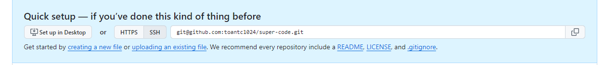

`Bước 6`: Bùm!!! Đăng code lên Github bằng lệnh sau:

```sh
git push -u origin main
```

Lưu ý: `main` là tên nhánh mà bạn đã đặt ở `bước 4` nhé.

Tadaaaa! Reload lại trang và chờ xem \(￣︶￣\*\).

Nếu bị lỗi bạn có thể liên hệ mình qua Zalo để được hỗ trợ nha: `0769394157`

## Đăng tải code hiện tại từ lần thứ 2 trở đi lên Github

Ví dụ trong thư mục lúc nãy, mình vừa sửa lại file `tong.cpp` và mình muốn up lên lại thì mình sẽ tiến hành như sau

Ghi chú: Hãy đảm bảo thư mục bạn muốn up đã được cài đặt git nhé! (Sẽ có một thư mục bị ẩn là .git)

Bước 1: Kiểm tra các file nào đã thay đổi

```sh
git status
```

Bước 2: Thêm các file

```sh
git add .
```

Bước 3: Commit các file (lưu ý message như phần ở trên nhá!)

```sh
git commit -m "message"
```

Bước 4: Upload code lên Github

```sh
git push
```

Ở bước thứ 3, nếu như bạn đã đổi nhánh thì sẽ có thêm `git push -u <ten_nhanh>`

Tadataa!!!!

## Lấy code Github về sửa và đăng lên lại

(Cách này chỉ có thể áp dụng với các repo mà bạn là collaborator hoặc owner thoy nha!!)

Nếu lúc tạo repo bạn tích vào README.md thì tức là code đã có trên Github, nếu bạn dùng cách ở trên thì sẽ bị lỗi ghi đè. Bây giờ bạn sẽ thực hiện các thao tác sau

Bước 1: Tại trang của repo trên Github, bạn nhìn vào nút <> Code

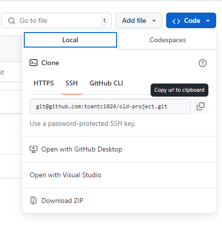

Bước 2: Sau đó copy link HTTPS

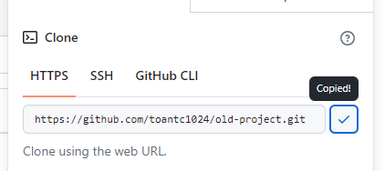

Bước 3: Bạn mở cmd lên và dẫn tới thư mục muốn chứa code

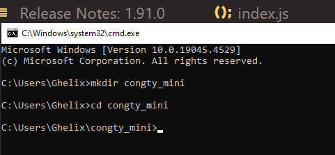

Bước 4: Để tải code về chúng ta dùng lệnh

```sh
git clone <link_https>
```

`link_https` tương ứng ở bước 2 trong clipboard. Sau đó bạn ấn enter.

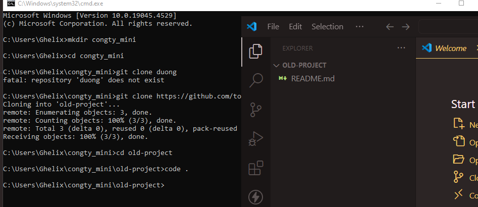

Tuyệt mình đã clone thành công và bây giờ bạn có thể sửa code và thực hiện các bước như ở bước Đăng tải code từ lần thứ 2 trở đi.

### Cảm ơn các bạn đã đọc qua bài viết này nha. 🤟😍
