# Nhiệm vụ #1: Branch, resolve conflict

#### [toantc1024](https://github.com/toantc1024/)

##### Ở buổi học trước đó, chúng ta đã cùng nhau tìm hiểu về Git là gì và tại sao lại cần Git. Nếu như chưa xem qua bạn có thể xem lại [tại đây](https://github.com/toantc1024/super-base/blob/master/README.md).

## Branch là gì?

Git được chia làm nhiều repo, mỗi repo bạn có thể ví nó như một dự án của bạn. Một dự án có thể chia làm nhiều phiên bản hay nhiều giai đoạn ví dụ như: kiểm thử (test), phát triển (develop), production (hoàn chỉnh), ...

Vậy thì làm sao để chúng ta có thể phân chia thành các phiên bản đó? Đó chính là nhờ có branch trong Git. Branch là việc sao chép các file của nhánh hiện tại (hay phiên bản hiện tại) sang một nhánh khác (phiên bản con).

Ví dụ mình đang có một repo Git như sau:

Bạn có thể khởi tạo một repo Git mới như ở buổi học trước nhé!

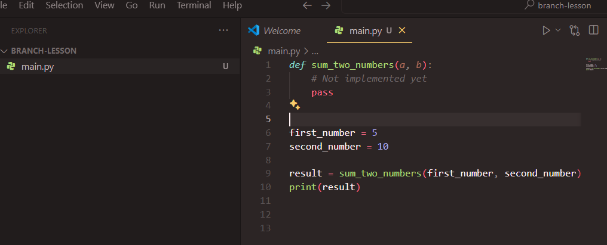

là mình đang ở branch master. Bây giờ mình cần phân nhánh để phát triển hàm `sum_of_two_numbers` cho nên mình sẽ tạo một nhánh mới.

Để tạo nhánh mới chúng ta sử dụng lệnh

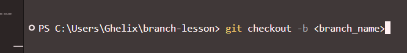

trong đó <branch_name> là tên nhánh của bạn muốn đặt.

Phiên bản bạn thay đổi trên một nhánh sẽ lưu trên nhánh đó. Để chuyển sang nhánh khác bạn có thể gõ lệnh
`git checkout <branch_name>`

trong đó <switch_branch_name> là tên nhánh bạn muốn chuyển sang (switch_branch_name phải là các nhánh hiện có trên remote/local của repo hiện tại nhe!)

## Branch name đặt gì cũng được ha? 😭 Nooooo

Nếu như bây giờ tớ phân cho đứa bạn code một tính năng nào đó. Ví dụ như một ứng dụng quản lý nhân viên, mình phân cho bạn ấy tính bảng lương của nhân viên thuộc một phòng ban nào đó đi. Bạn ấy đặt tên nhánh là `something`. Bạn sẽ cảm thấy như thế nào nè? P/s: Ultra... thèn quỹ

Cho nên á, chúng ta cần có một quy tắt đặt tên nhánh. Bạn có thể đọc thêm chi tiết tại [bài viết này](https://dev.to/couchcamote/git-branching-name-convention-cch) nhé!

Một số điều chúng ta thường làm là:

Đối với phát triển tính năng feature/<feature_name> VD: feature/salary-table
Đôí với sửa lỗi fix/<bug_name> VD: fix/employee-collision

## Okay, chúng ta đã có nhánh rồi, giờ làm sao để làm việc chung trên nhánh nè?

Bây giờ chúng ta sẽ lấy repo `super-app` làm ví dụ.

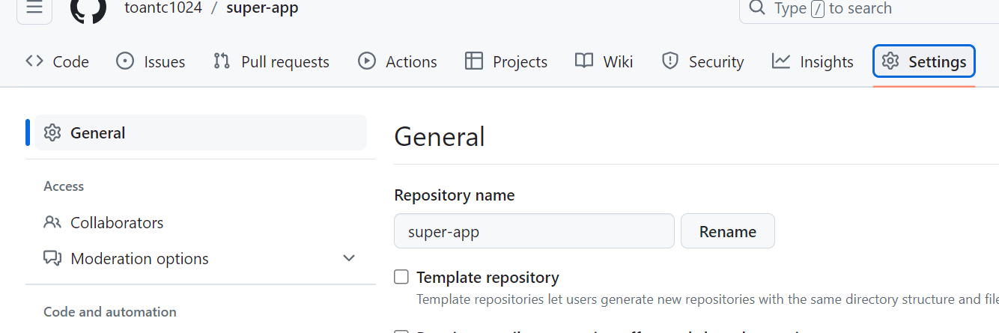
Đầu tiên mình sẽ vào trong setting trong repo và ấn vào collaborator

Sau đó invite teammate của bạn
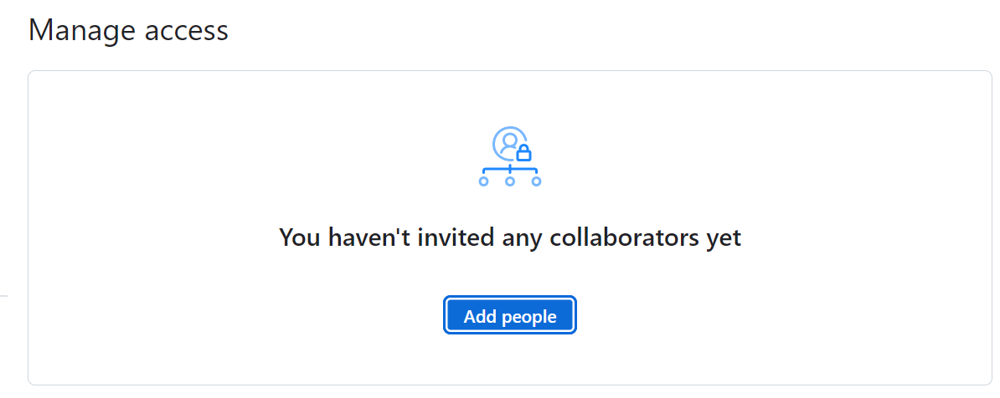

Bây giờ mình sẽ là người được invite, mình sẽ vào đường link của repo đó và clone về máy

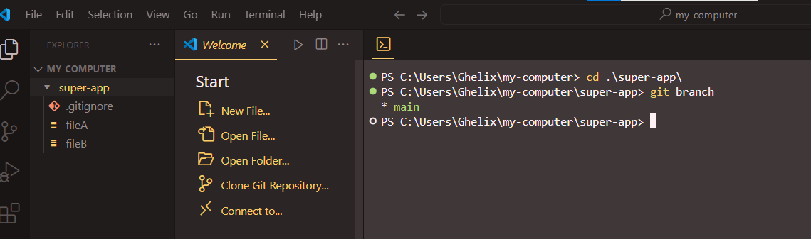

Hiện tại mình đang ở nhánh `main`

Okay, bây giờ mình sẽ tạo nhánh `develop` từ nhánh `main` (copy các file từ nhánh main sang một nhánh mới tên là `develop`)

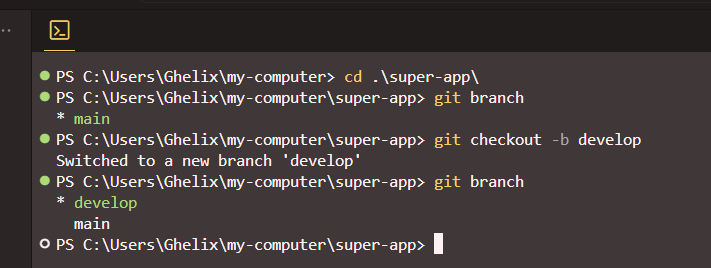

Lưu ý: Tại đây, các bạn cần phải lưu ý là phải để ý xem mình đang ở nhánh nào, liệu đó có phải nhánh sản phẩm chính thức hay không? Hay là nhánh đang phát triển. Và sau đó chuyển sang nhánh sẽ làm việc.

Ví dụ, bây giờ mình được trưởng nhóm phân cho làm một tính năng là tạo `fileC`. Thì mình sẽ tạo nhánh mới từ nhánh `develop` (đảm bảo bạn đang ở nhánh develop bằng lệnh `git branch` nhé!)

```sh
git checkout -b feature/add-file
```

Bây giờ mình sẽ tạo fileC và đẩy code lênh bằng các lệnh dưới đây

```sh
git add .
git commit -m "Update: Add fileC"
git push -u origin feature/add-file"
```

Ghi chú: Tại sao lại có -u ạ? 🙉 => Là vì mình mới chuyển sang nhánh feature/add-file nhé! ✨ Từ lần thứ 2 nếu em vẫn ở nhánh này thì không cần nữa.

Sau đó mình sẽ làm thêm một tính năng

## Merge

Bây giờ mình có rất nhiều nhánh, vậy làm sao để hợp nhất các nhánh lại với nhau?

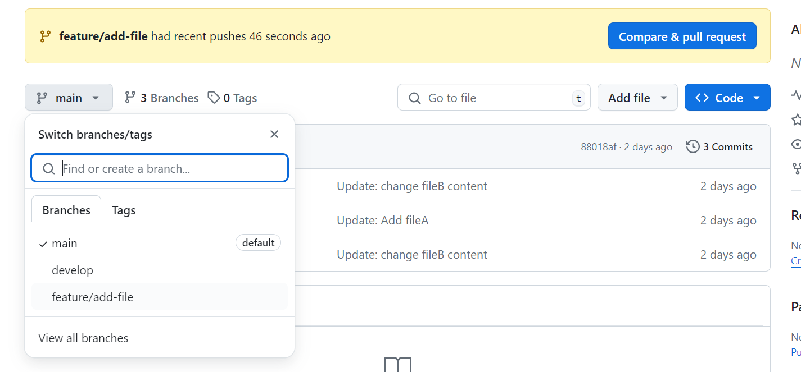

Đối với dịch vụ Github, các bạn có thể làm như sau

Ấn vào pull request trên repo của bạn

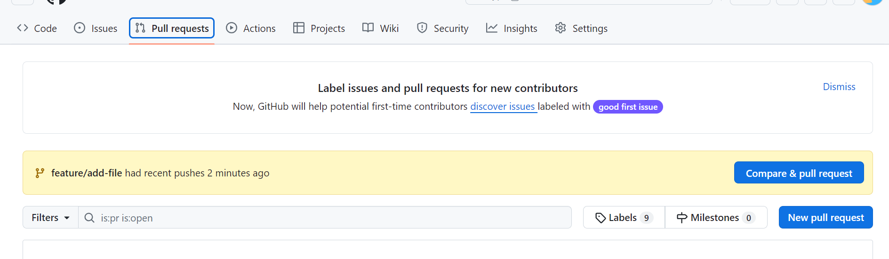

Chọn new pull request

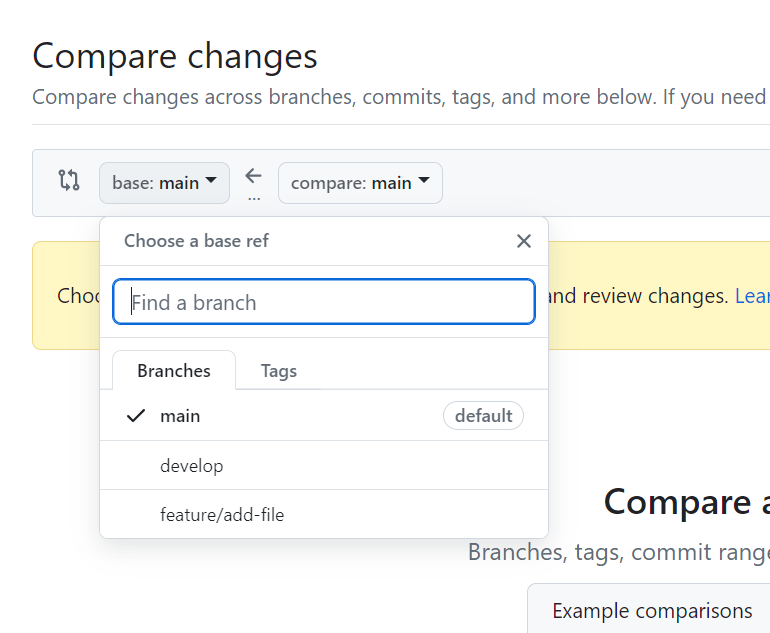

Ở đây có base là nhánh mà bạn sẽ gộp code vào. Ở đây có base và compare. Tức là ta đang lấy code từ nhánh compare gộp vào nhánh base!

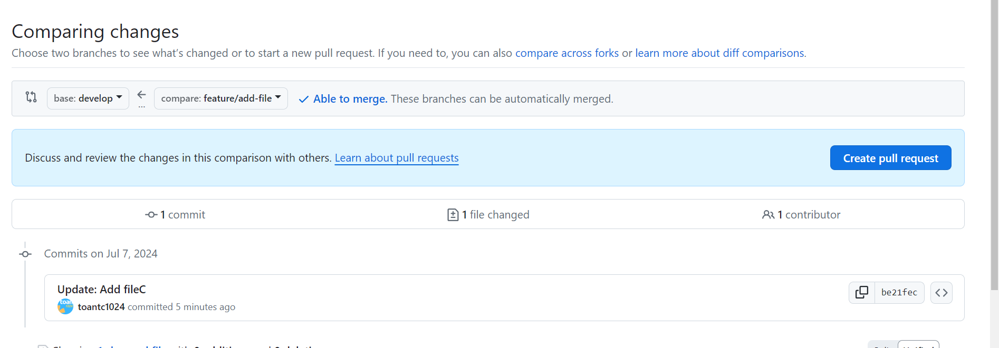

Okay, do luồng là nhánh `develop` là nhánh đang phát triển cho nên chúng ta sẽ gộp code từ nhánh `feature/add-file` vào trong develop. Vì thế base là `develop` và compare là `feature/add-file`.

Và cuối cùng ấn Create pull request

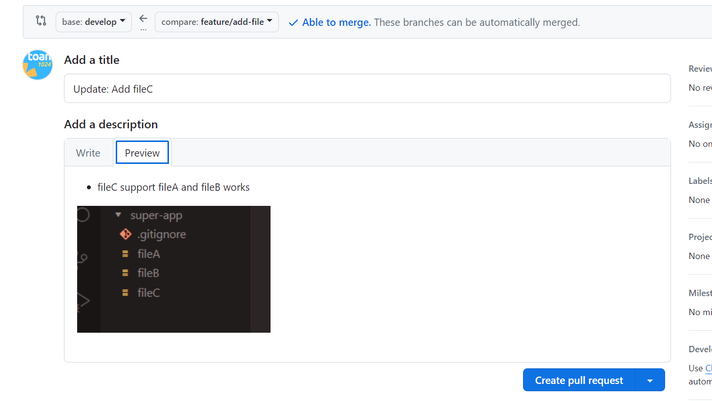

Khuyến khích:

- Viết tile và description rõ ràng để người review pull request sẽ dễ dàng

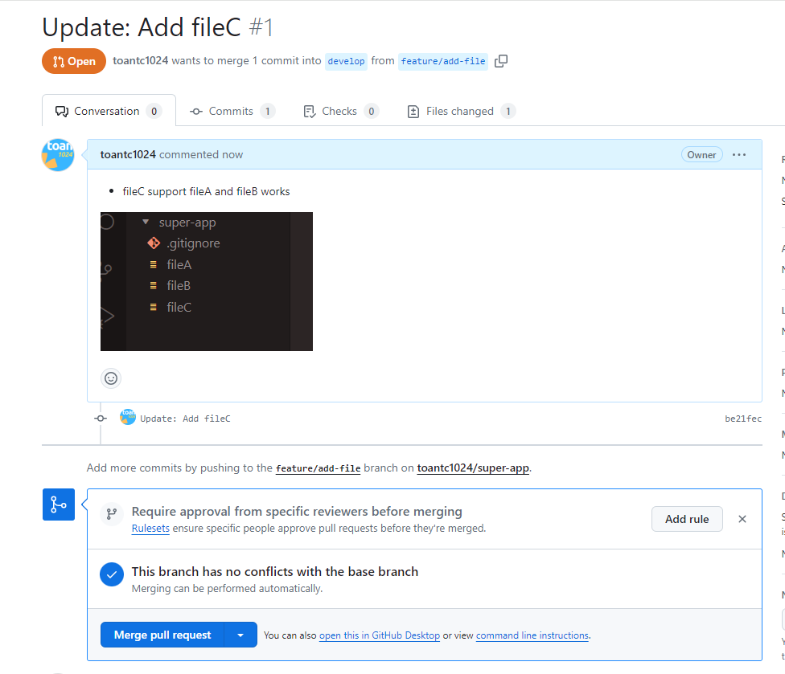

Bây giờ chính người sở hữu hoặc một số người được phân công việc review code sẽ ấn vào Pull request và review qua code bằng cách ấn vào File Change


Sau khi hoàn thành việc review và update lại (Giống như việc push code lên repo)

Cuối cùng một thành viên sẽ ấn gộp nhất code

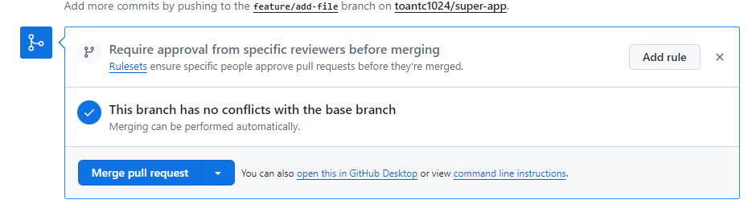

Thường sau khi gộp nhất xong nhánh ở phần compare sẽ bị xóa


Bây giờ code ở nhánh `develop` đã thay đổi, chúng ta sẽ tiến hành đổi sang nhánh `develop`. Bạn sẽ không thấy fileC. Vì bạn code của bạn chưa cập nhật từ remote trên Github.

Vậy để cập nhật code từ Github remote về nhánh hiện tại ta làm như sau

```sh
git pull
```

Còn nếu muốn lấy code về các nhánh khác mà không về nhánh hiện tại thì ta dùng lệnh

```sh
git fetch
```

Lưu ý: git pull và git fetch rất dễ bị nhầm lẫn. Bạn có thể đọc thêm [tại đây](https://www.theserverside.com/blog/Coffee-Talk-Java-News-Stories-and-Opinions/Git-pull-vs-fetch-Whats-the-difference#:~:text=The%20key%20difference%20between%20git,git%20pull%20command%20does%20both.) để làm rõ nhé!

## Conflict

Okay, bây giờ có một trường hợp mình sửa nội dung fileC ở nhánh `feature/add-file` như sau

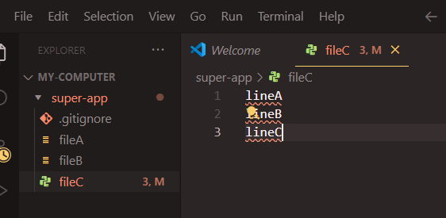

Một bạn B cũng tạo nhánh feature/update-fileC và cũng sửa fileC như sau
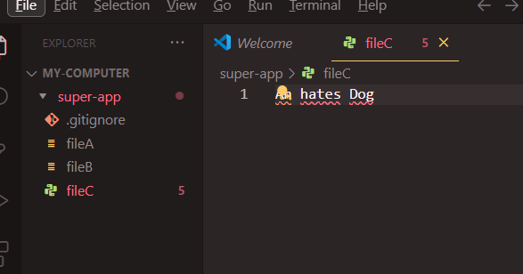

Trường hợp bạn B push code từ nhánh feature/update-fileC của bạn ấy lên và merge trước vào nhánh develop.

Sau đó mình mới push code của mình lên.

Vậy chuyện gì sẽ xảy ra?

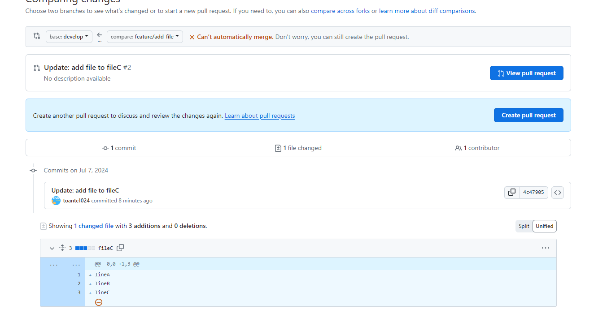

Code trên nhánh develop xung đột với code từ nhánh của mình.

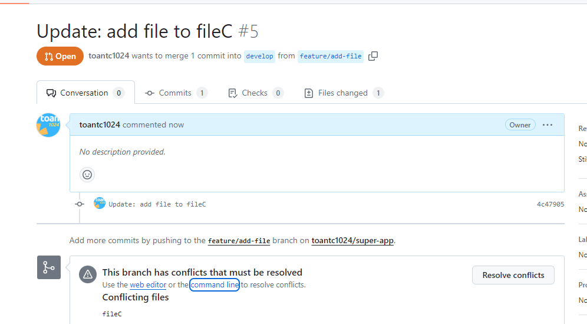

## Resolve conflict

Video dưới đây sẽ hướng dẫn cách resolve conflict trên Github remote cũng như local

<video controls src="chrome_eh5BHEoHx2.mp4" title="Title"></video>

Cách làm trên local

Pull code từ remote về develop

```sh
git checkout develop # Chuyển sang nhánh develop
git pull
```

Sau đó chuyển lại sang nhánh feature/add-file

```sh
git checkout feature/add-file
```

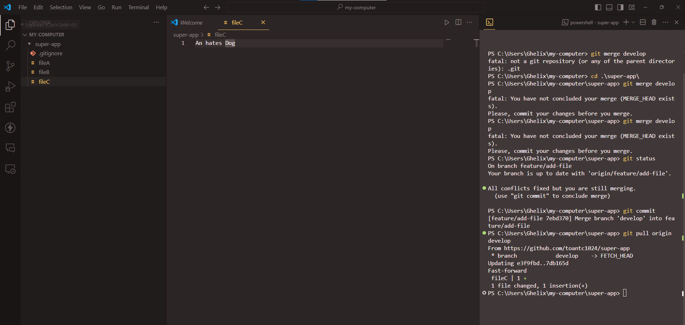

Để gộp nhánh develop vào nhánh hiện tại (feature/add-file) ta dùng lệnh

```sh
git merge develop
```

Và nó sẽ tự động hiện ra conflict

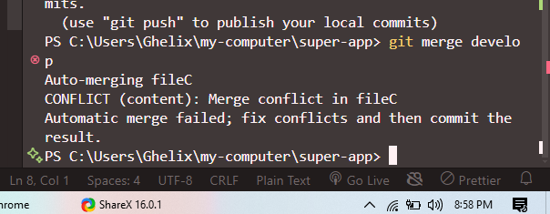

Trên VSCode sẽ có những option màu xanh biển

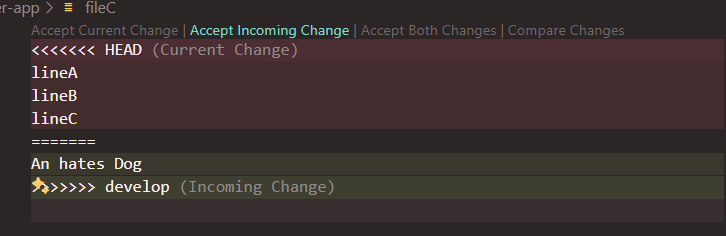

Ghi chú:

- Accept current change: Là giữ nội dung file trên nhánh feature/add-file
- Accept incoming change: Giữ nội dung trên nhánh develop
- Accept both change: Giữ cả hai

Sau khi đã hoàn tất resolve conflict, chúng ta sẽ thực hiện việc push code lên như bình thường

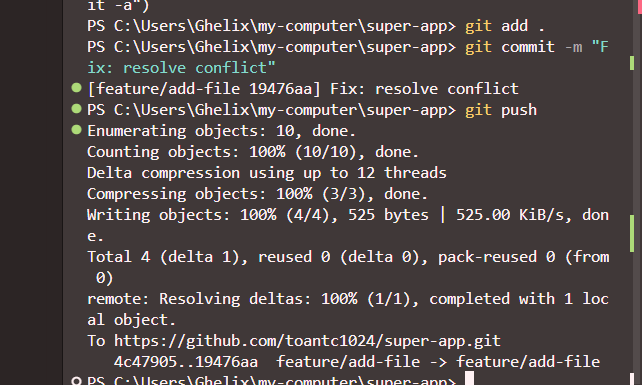

Sau đó kiểm tra github repo sẽ thấy không còn conflict

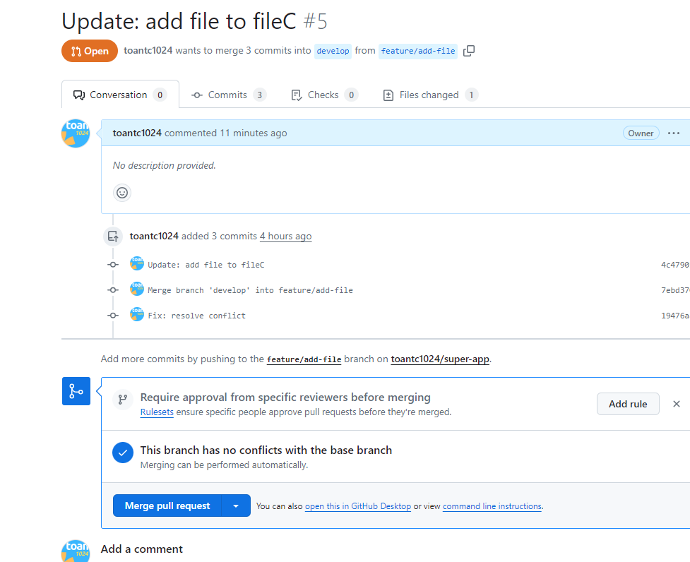

Và cuối cùng là
`Confirm merge`

### Cảm ơn các bạn đã đọc qua bài viết này nha. 🤟😍
